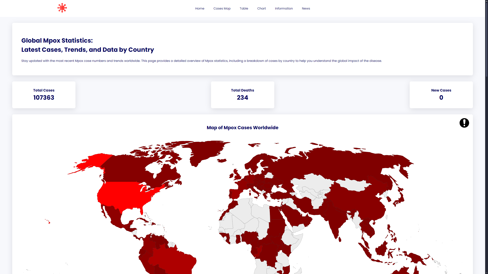
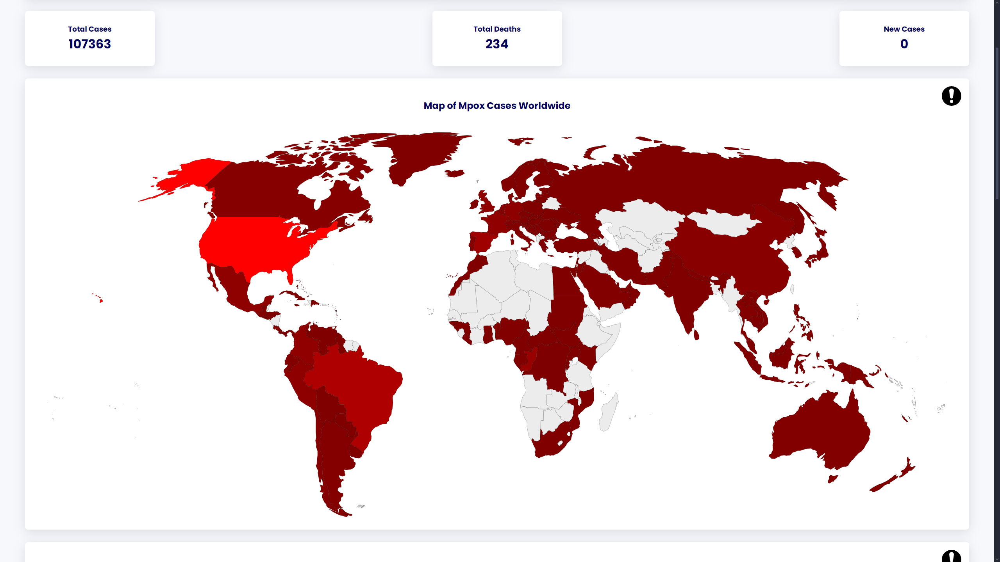
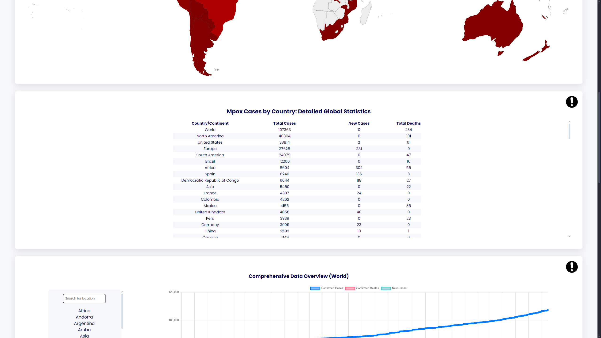
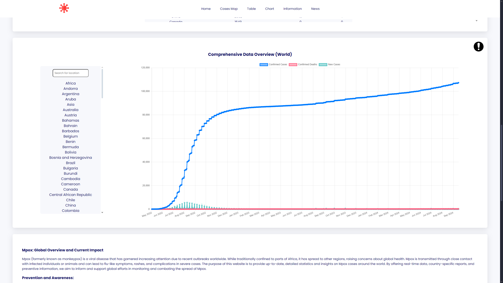
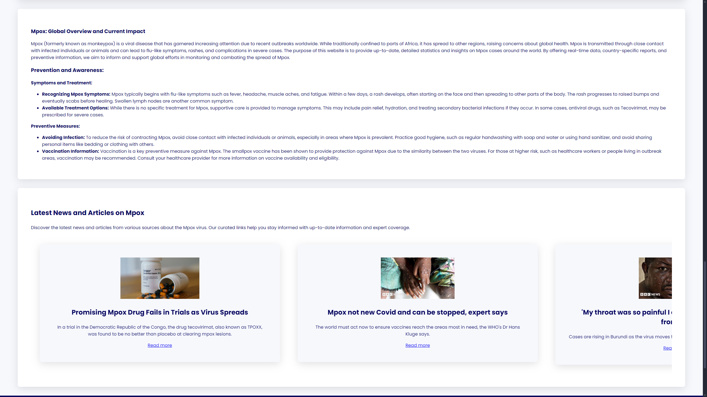

# **Mpox Statistics Dashboard**

A comprehensive **Mpox Statistics Dashboard** built with Angular, offering up-to-date information about Mpox. The dashboard includes:

- 📊 **Statistics**: Key numbers and data related to Mpox.
- 🌍 **Map**: Geographical distribution of cases.
- 📈 **Charts**: Visual representation of the statistics.
- 📋 **Tables**: Organized data tables for better insight.
- 📰 **News**: Latest updates from Google News on Mpox.
- ℹ️ **Information**: General details about Mpox from verified sources.

---

## **Features**
- **Real-time data** from [Our World in Data](https://ourworldindata.org/) (public API, no key needed).
- **Mpox news feed** from Google News (private API key required).
- **Interactive charts and maps** to visualize the data.
- **Responsive design**: Works across all devices.

---

## **Technologies Used**
- **Angular** (Front-end framework)
- **Google News API** (Private key required for fetching Mpox-related news)
- **Our World in Data API** (Public API for Mpox statistics)
- **Chart.js** (For chart visualization)

---

## **Screenshots**






---

## **Installation and Setup**

### **Prerequisites**
- **Node.js** (>= 14.x)
- **Angular CLI** (>= 12.x)
- A valid **Google News API Key**

### **Steps to Clone and Build the Project**

1. **Clone the Repository**

   ```bash
   git clone https://github.com/MinoMakh/mpox-statistics-dashboard.git
   cd mpox-statistics

2. **Install Dependencies**

   Run the following command to install the necessary packages:

   ```bash
   npm install

3. **Set Up Google News API Key**

   Open the file `src/app/config.service.ts` and replace the existing API key with your own Google News API key:

   ```typescript
     private config = {
        // Google news api key
        apiKey: 'YOUR-API-KEY'
  }


4. **Build the Project**

   Build the Angular project for production:

   ```bash
   ng build --prod

5. **Run the Application**

   Serve the application locally:

   ```bash
   ng serve

Navigate to http://localhost:4200/ to view the application in your browser.